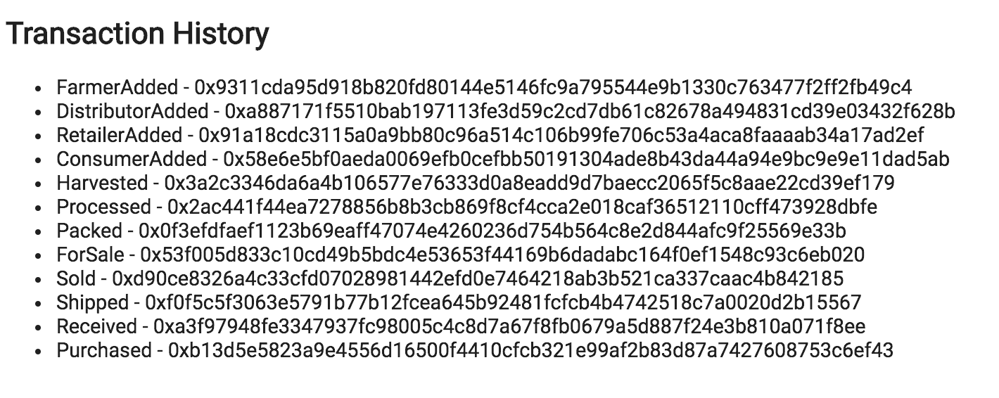

# Architect a Supply Chain: Part B - Coffee Supply Chain

This repository containts an Ethereum DApp that demonstrates a Supply Chain flow between a Seller and Buyer. The user story is similar to any commonly used supply chain process. A Seller can add items to the inventory system stored in the blockchain. A Buyer can purchase such items from the inventory system. Additionally a Seller can mark an item as Shipped, and similarly a Buyer can mark an item as Received.

The DApp User Interface when running should look like...





## Getting Started

These instructions will get you a copy of the project up and running on your local machine for development and testing purposes. See deployment for notes on how to deploy the project on a live system.

### Prerequisites

Please make sure you've already installed ganache-cli, Truffle and enabled MetaMask extension in your browser.


### Installing

A step by step series of examples that tell you have to get a development env running

Clone this repository:

```
git clone https://github.com/xu4/blockchain-nanodegree-project6
```

Change directory to ```app``` folder and install all requisite npm packages:

```
cd app
npm install
```

Launch Ganache:

```
ganache-cli -m "aware gift when head gossip spider bike corn input juice battle dress"
```

Your terminal should look something like this:


In a separate terminal window, Compile smart contracts:

```
truffle compile
```

Your terminal should look something like this:


This will create the smart contract artifacts in folder ```build\contracts```.

Migrate smart contracts to the locally running blockchain, ganache-cli:

```
truffle migrate
```

Your terminal should look something like this:


Test smart contracts:

```
truffle test
```

All 11 tests should pass.


In a separate terminal window, launch the DApp:

```
npm run dev
```

* Go to http://localhost:3000/ and interact with the contract. 
* Only the owner of the contract can set roles which can operate the supply chain.
* Contract Owner ID will display on the form when the page loads. Make sure MetaMask is using the Contract Owner’s account. 
* Enter Farmer ID, Distributor ID, Retailer ID and Consumer ID, Click Setup Roles button.  The Farmer ID will have FarmerRole, Distributor ID will have DistributorRole, Retailer ID will have RetailerRole and Consumer ID will have ConsumerRole
* When you are ready to perform Harvest, Process, Pack, ForSale action as the farmer, make sure MetaMask is using the Farmer’s account. The same applies to Distributor, Retailer and Consumer
* Transaction History lists all the transactions.


## Built With

* [Ethereum](https://www.ethereum.org/) - Ethereum is a decentralized platform that runs smart contracts
* [Truffle Framework](http://truffleframework.com/) - Truffle is the most popular development framework for Ethereum with a mission to make your life a whole lot easier.


## Versions

* Solidity: v0.4.24 
* Truffle: v4.1.15 
* Web3.js: v1.0

## Contract on rinkeby

Address: 0x55303749064bd75ab5fd04cd0b5fe74725382f74


## UML Digrams

In the /diagrams/ folder you will find the following UML diagrams:

* Activity diagram 
* Sequence diagram 
* State diagram 
* Class diagram 
